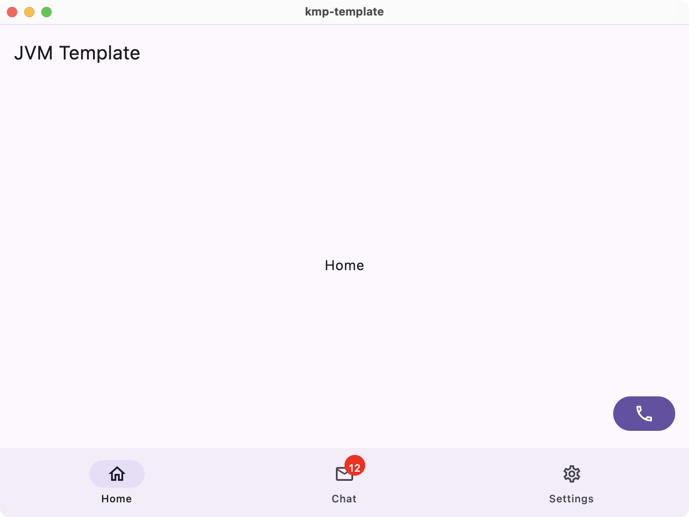
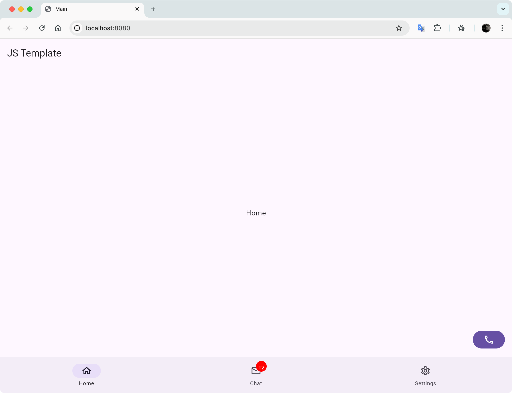
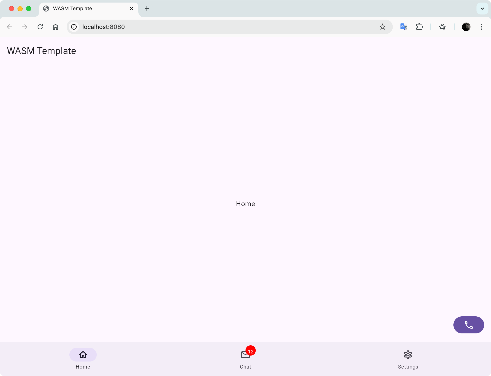

Kotlin Multiplatform Template
=

This is a Kotlin Multiplatform project targeting Android, iOS, Web, Desktop.

## Screenshots

**Android**

    

 

**iOS**

    

 

**JVM Desktop (macOS)**

    

 

**JavaScript (Chrome Desktop)**

    

 

**WASM (Chrome Desktop)**

    

